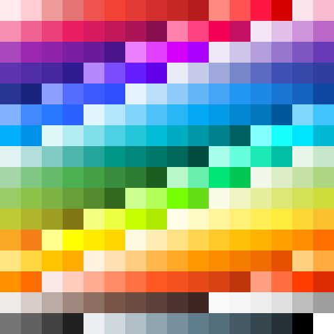

# materialcolors 

Material design color palette for Go.

Source: https://material.google.com/style/color.html

Documentation: https://godoc.org/github.com/disintegration/materialcolors

License: MIT

